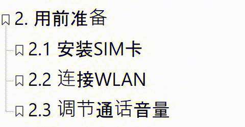
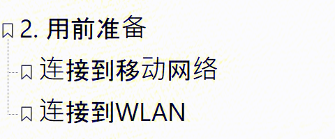
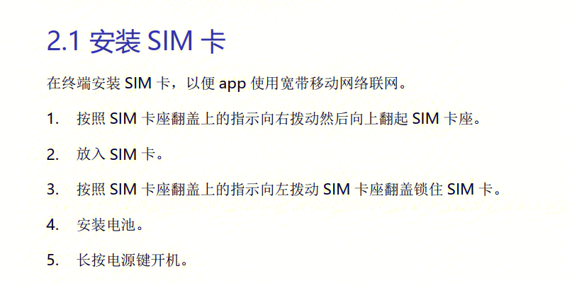
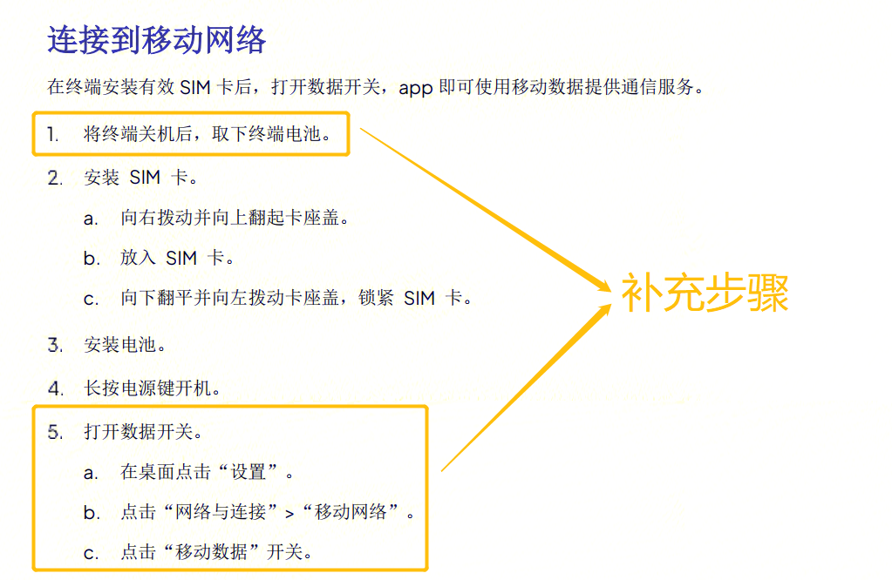
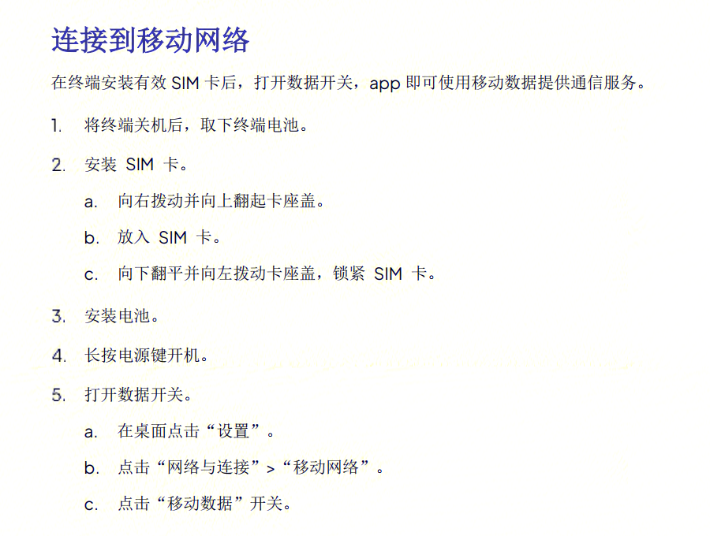
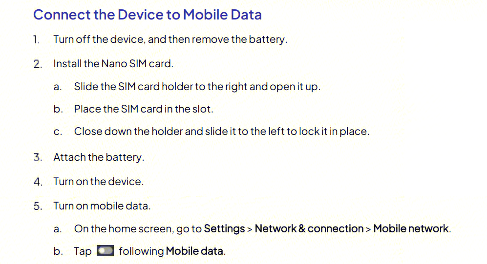

# 用户手册优化示例：标题与正文

本页面展示对用户手册中标题、正文的优化示例，并附上对应的英文片段。

## 背景信息

| 项目 | 说明 |
|------|------|
| 产品类型 | 通信 App |
| 操作目的 | 让设备连接到网络 |

## 优化标题

| 优化前 | 优化后 |
|--------|--------|
|  |  |

### 优化说明

- **将用户目的改为标题**  
  本章节的目的是将设备连接到互联网。原小节标题"安装SIM卡"只是连接移动网络的步骤，并非最终目的。

- **改用无序列表**  
  有序列表适用于需要按顺序执行的步骤。但将设备连接到移动网络或 WLAN，用户可根据实际情况任选其一，因此应使用无序列表，避免用户的误解。

- **删除不必要的小节**  
  是否调节通话音量，并非使用 App 的必要前提，与其他两个小节的重要程度不同。因此删去，可调整到基础操作章节。

## 优化正文

| 优化前 | 优化后 |
|--------|--------|
|  |  |

### 优化说明

- **补充缺失步骤**  
  安装 SIM 卡后，用户还需打开数据开关，设备才能连接到互联网。但原正文中没有相关描述，可能导致用户操作失败。

- **合并步骤**  
  补充步骤后，如果一一列开，将有 11 个步骤，不符合技术写作操作步骤的限制（不超过 7 个步骤）。因此将步骤重新划分，将同一目的的步骤合为一个，将相关步骤变为二级步骤。最终将步骤数量控制为 5 个，可有效减少用户阅读压力。

## 英文对照
| 优化前 | 优化后 |
|--------|--------|
|  |  |