操作指南（面向翻译）

MadCap Flare

# 目录 {#目录 .TOC-Heading}

[1. 文档概览
[4](#文档概览)](file:///D:\02-项目总结\平台工作\小组分享\Flare%20使用教程\MadCap%20Flare%20操作指南（面向翻译）%20V01.docx#_Toc204870215)

> [1.1 文档目的
> [4](#文档目的)](file:///D:\02-项目总结\平台工作\小组分享\Flare%20使用教程\MadCap%20Flare%20操作指南（面向翻译）%20V01.docx#_Toc204870216)
>
> [1.2 目标读者
> [4](#目标读者)](file:///D:\02-项目总结\平台工作\小组分享\Flare%20使用教程\MadCap%20Flare%20操作指南（面向翻译）%20V01.docx#_Toc204870217)
>
> [1.3 适用范围
> [4](#适用范围)](file:///D:\02-项目总结\平台工作\小组分享\Flare%20使用教程\MadCap%20Flare%20操作指南（面向翻译）%20V01.docx#_Toc204870218)

[2. 基本概念
[5](#基本概念)](file:///D:\02-项目总结\平台工作\小组分享\Flare%20使用教程\MadCap%20Flare%20操作指南（面向翻译）%20V01.docx#_Toc204870219)

> [2.1 Topic
> [5](#topic)](file:///D:\02-项目总结\平台工作\小组分享\Flare%20使用教程\MadCap%20Flare%20操作指南（面向翻译）%20V01.docx#_Toc204870220)
>
> [2.2 Target
> [5](#target)](file:///D:\02-项目总结\平台工作\小组分享\Flare%20使用教程\MadCap%20Flare%20操作指南（面向翻译）%20V01.docx#_Toc204870221)
>
> [2.3 TOC
> [6](#toc)](file:///D:\02-项目总结\平台工作\小组分享\Flare%20使用教程\MadCap%20Flare%20操作指南（面向翻译）%20V01.docx#_Toc204870222)
>
> [2.4 Snippet
> [7](#snippet)](file:///D:\02-项目总结\平台工作\小组分享\Flare%20使用教程\MadCap%20Flare%20操作指南（面向翻译）%20V01.docx#_Toc204870223)
>
> [2.5 Text Editor
> [8](#text-editor)](file:///D:\02-项目总结\平台工作\小组分享\Flare%20使用教程\MadCap%20Flare%20操作指南（面向翻译）%20V01.docx#_Toc204870224)
>
> [2.6 XML Editor
> [9](#xml-editor)](file:///D:\02-项目总结\平台工作\小组分享\Flare%20使用教程\MadCap%20Flare%20操作指南（面向翻译）%20V01.docx#_Toc204870225)

[3. 工作流程
[10](#工作流程)](file:///D:\02-项目总结\平台工作\小组分享\Flare%20使用教程\MadCap%20Flare%20操作指南（面向翻译）%20V01.docx#_Toc204870226)

[4. 文字相关操作
[14](#文字相关操作)](file:///D:\02-项目总结\平台工作\小组分享\Flare%20使用教程\MadCap%20Flare%20操作指南（面向翻译）%20V01.docx#_Toc204870227)

> [4.1 编辑Topic内容
> [14](#编辑topic内容)](file:///D:\02-项目总结\平台工作\小组分享\Flare%20使用教程\MadCap%20Flare%20操作指南（面向翻译）%20V01.docx#_Toc204870228)
>
> [4.2 添加新的Topic
> [14](#添加新的topic)](file:///D:\02-项目总结\平台工作\小组分享\Flare%20使用教程\MadCap%20Flare%20操作指南（面向翻译）%20V01.docx#_Toc204870229)
>
> [4.3 打开跳转页面
> [16](#打开跳转页面)](file:///D:\02-项目总结\平台工作\小组分享\Flare%20使用教程\MadCap%20Flare%20操作指南（面向翻译）%20V01.docx#_Toc204870230)
>
> [4.4 添加超链接
> [17](#添加超链接)](file:///D:\02-项目总结\平台工作\小组分享\Flare%20使用教程\MadCap%20Flare%20操作指南（面向翻译）%20V01.docx#_Toc204870231)
>
> [4.5 设置发布格式
> [18](#设置发布格式)](file:///D:\02-项目总结\平台工作\小组分享\Flare%20使用教程\MadCap%20Flare%20操作指南（面向翻译）%20V01.docx#_Toc204870232)

[5. 图片相关操作
[20](#图片相关操作)](file:///D:\02-项目总结\平台工作\小组分享\Flare%20使用教程\MadCap%20Flare%20操作指南（面向翻译）%20V01.docx#_Toc204870233)

> [5.1 添加图片到resources文件夹
> [20](#添加图片到resources文件夹)](file:///D:\02-项目总结\平台工作\小组分享\Flare%20使用教程\MadCap%20Flare%20操作指南（面向翻译）%20V01.docx#_Toc204870234)
>
> [5.2 添加新图片
> [20](#添加新图片)](file:///D:\02-项目总结\平台工作\小组分享\Flare%20使用教程\MadCap%20Flare%20操作指南（面向翻译）%20V01.docx#_Toc204870235)
>
> [5.3 更换截图
> [21](#更换截图)](file:///D:\02-项目总结\平台工作\小组分享\Flare%20使用教程\MadCap%20Flare%20操作指南（面向翻译）%20V01.docx#_Toc204870236)
>
> [5.4 更改图片大小
> [23](#更改图片大小)](file:///D:\02-项目总结\平台工作\小组分享\Flare%20使用教程\MadCap%20Flare%20操作指南（面向翻译）%20V01.docx#_Toc204870237)
>
> [5.5 更改图片位置
> [24](#更改图片位置)](file:///D:\02-项目总结\平台工作\小组分享\Flare%20使用教程\MadCap%20Flare%20操作指南（面向翻译）%20V01.docx#_Toc204870238)
>
> [5.6 设置发布格式
> [25](#设置发布格式-1)](file:///D:\02-项目总结\平台工作\小组分享\Flare%20使用教程\MadCap%20Flare%20操作指南（面向翻译）%20V01.docx#_Toc204870239)

[6. 表格相关操作
[26](#表格相关操作)](file:///D:\02-项目总结\平台工作\小组分享\Flare%20使用教程\MadCap%20Flare%20操作指南（面向翻译）%20V01.docx#_Toc204870240)

> [6.1 插入行或列
> [26](#插入行或列)](file:///D:\02-项目总结\平台工作\小组分享\Flare%20使用教程\MadCap%20Flare%20操作指南（面向翻译）%20V01.docx#_Toc204870241)
>
> [6.2 删除行或列
> [26](#删除行或列)](file:///D:\02-项目总结\平台工作\小组分享\Flare%20使用教程\MadCap%20Flare%20操作指南（面向翻译）%20V01.docx#_Toc204870242)

[7. 发布相关操作
[28](#发布相关操作)](file:///D:\02-项目总结\平台工作\小组分享\Flare%20使用教程\MadCap%20Flare%20操作指南（面向翻译）%20V01.docx#_Toc204870243)

> [7.1 设置Primary Target
> [28](#设置primary-target)](file:///D:\02-项目总结\平台工作\小组分享\Flare%20使用教程\MadCap%20Flare%20操作指南（面向翻译）%20V01.docx#_Toc204870244)
>
> [7.2 查看Primary Target设置
> [28](#查看primary-target设置)](file:///D:\02-项目总结\平台工作\小组分享\Flare%20使用教程\MadCap%20Flare%20操作指南（面向翻译）%20V01.docx#_Toc204870245)
>
> [7.3 设置Master TOC
> [29](#设置master-toc)](file:///D:\02-项目总结\平台工作\小组分享\Flare%20使用教程\MadCap%20Flare%20操作指南（面向翻译）%20V01.docx#_Toc204870246)
>
> [7.4 查看Master TOC设置
> [29](#查看master-toc设置)](file:///D:\02-项目总结\平台工作\小组分享\Flare%20使用教程\MadCap%20Flare%20操作指南（面向翻译）%20V01.docx#_Toc204870247)
>
> [7.5 改变章节顺序
> [30](#改变章节顺序)](file:///D:\02-项目总结\平台工作\小组分享\Flare%20使用教程\MadCap%20Flare%20操作指南（面向翻译）%20V01.docx#_Toc204870248)
>
> [7.6 预览发布内容
> [30](#预览发布内容)](file:///D:\02-项目总结\平台工作\小组分享\Flare%20使用教程\MadCap%20Flare%20操作指南（面向翻译）%20V01.docx#_Toc204870249)
>
> [7.7 删除公司logo
> [31](#删除公司logo)](file:///D:\02-项目总结\平台工作\小组分享\Flare%20使用教程\MadCap%20Flare%20操作指南（面向翻译）%20V01.docx#_Toc204870250)
>
> [7.8 保存
> [31](#保存)](file:///D:\02-项目总结\平台工作\小组分享\Flare%20使用教程\MadCap%20Flare%20操作指南（面向翻译）%20V01.docx#_Toc204870251)
>
> [7.9 发布文件
> [32](#发布文件)](file:///D:\02-项目总结\平台工作\小组分享\Flare%20使用教程\MadCap%20Flare%20操作指南（面向翻译）%20V01.docx#_Toc204870252)

[8. 常见问题
[34](#常见问题)](file:///D:\02-项目总结\平台工作\小组分享\Flare%20使用教程\MadCap%20Flare%20操作指南（面向翻译）%20V01.docx#_Toc204870253)

[9. 常用格式的 XML 代码
[38](#常用格式的-xml-代码)](file:///D:\02-项目总结\平台工作\小组分享\Flare%20使用教程\MadCap%20Flare%20操作指南（面向翻译）%20V01.docx#_Toc204870254)

[10. 相关资料
[39](#相关资料)](file:///D:\02-项目总结\平台工作\小组分享\Flare%20使用教程\MadCap%20Flare%20操作指南（面向翻译）%20V01.docx#_Toc204870255)

前言

本文档主要介绍MadCap
Flare软件的基本操作，旨在帮助资料部同事输出网管产品的联机帮助、操作指南。

# 文档概览

## 文档目的

本指南主要介绍MadCap
Flare软件的基本概念、相关操作、常见问题，方便不熟悉该软件的同事迅速了解软件的常用操作，提高系统产品相关的工作效率。

## 目标读者

本指南的主要读者是英文技术写作、翻译、审校人员。

## 适用范围

本指南主要适用于网管产品的联机帮助、操作指南、产品概述等产品资料。

# 基本概念

MadCap Flare
是一款专为技术写作开发的同源写作软件，旨在将文档切分为单个模块，以维护单个模块的方式维护整个文档，最大限度地重复使用内容，并输出到多个渠道。

在翻译组的系统产品维护工作中，主要涉及该软件的以下几个概念。

## Topic

Topic相当于文档中的小节，包含了针对某个对象、话题的信息。

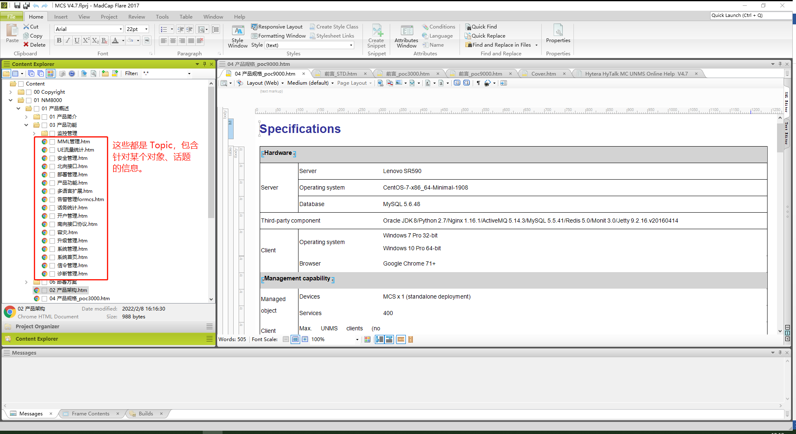{width="6.845833333333333in"
height="3.7381944444444444in"}

## Target

Target是最终输出的文件，由多个Topic组成。

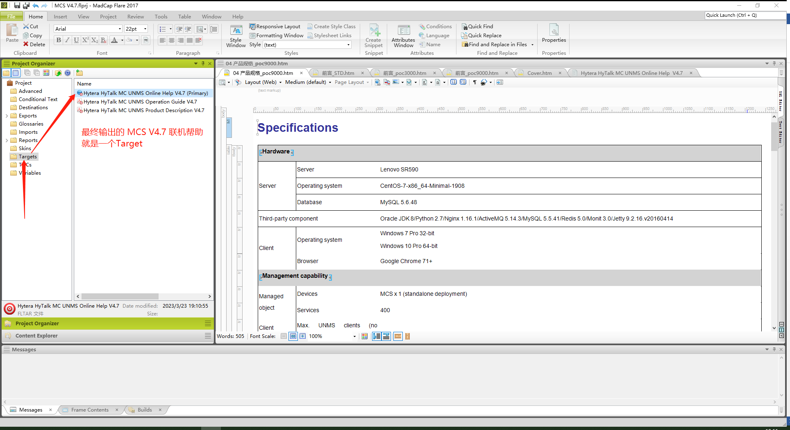{width="6.845833333333333in"
height="3.7381944444444444in"}

## TOC

TOC（Table of Content）是Target的目录文件。

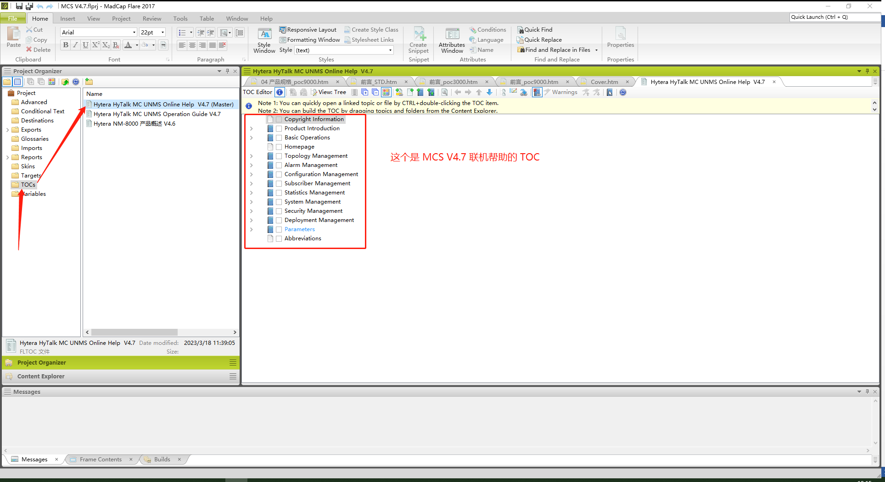{width="6.845833333333333in"
height="3.7381944444444444in"}

## Snippet

Snippet包含了一个Flare项目在不同渠道能多次利用的内容，可包括文字、图片、表格等。

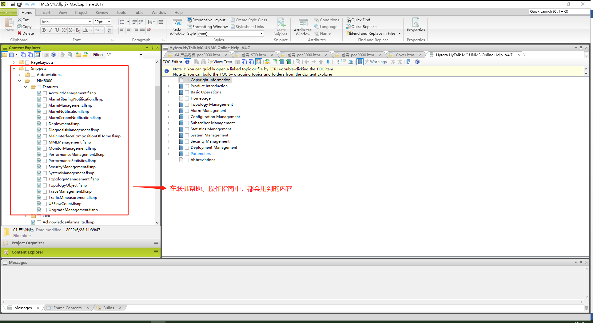{width="6.845833333333333in"
height="3.7381944444444444in"}

## Text Editor

Text Editor显示该页面的具体内容，如文字、图片、表格。

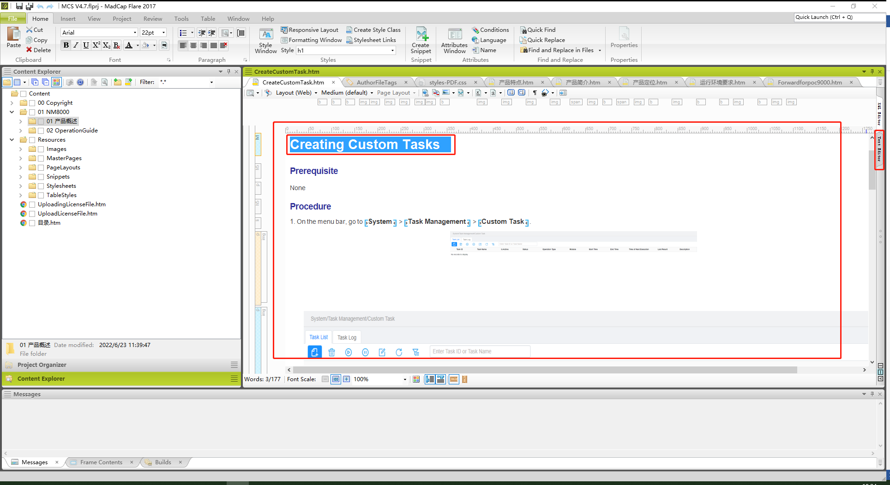{width="6.845833333333333in"
height="3.7381944444444444in"}

## XML Editor

XML Editor显示该页面内容的代码信息。

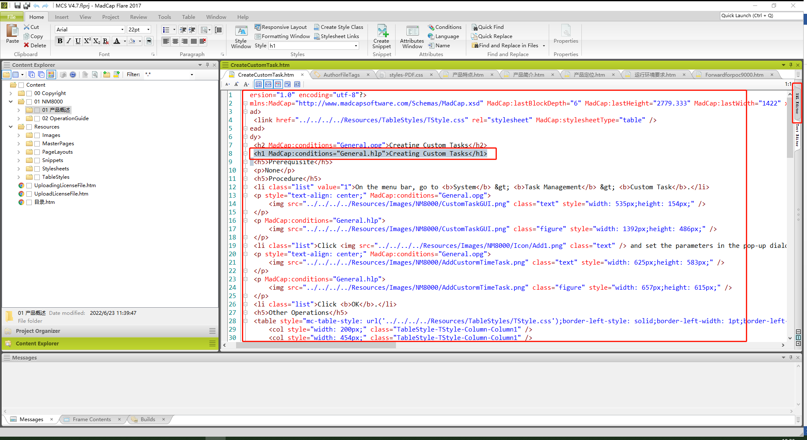{width="6.845833333333333in"
height="3.7381944444444444in"}

# 工作流程

- 更新文档（多数）

  a.  打开 Flare 文件。

      i.  在 SVN 找到上个版本的 Flare 压缩文件包，拖拽保存到本地。

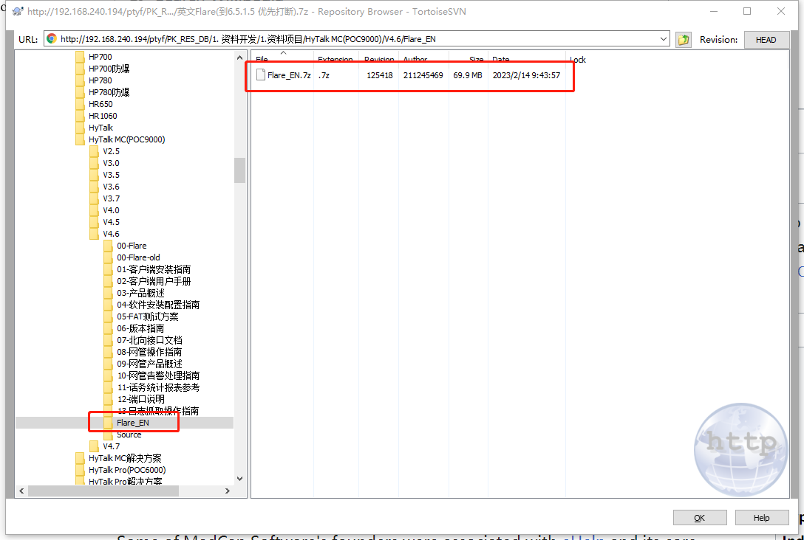{width="6.845833333333333in"
height="4.6in"}

+-----------------------------------------------------------------------+
| {width="0.6305555555555555in"                  |
| height="0.24583333333333332in"}                                       |
+=======================================================================+
| > 一些 Flare 文件较大，保存到本地耗时较久，属于正常情况。             |
+-----------------------------------------------------------------------+

ii. 解压文件包。

    解压后，文件夹一般包含
    "Analyzer"，"Content"，"Filesync"，"Output"，"Project"文件夹及
    .FLPRJ 文件。

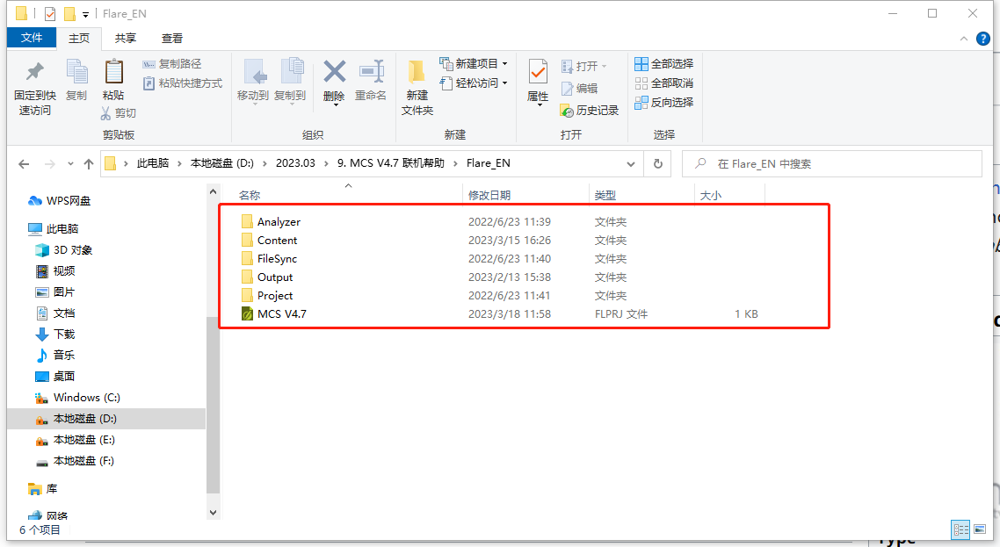{width="6.8381944444444445in"
height="3.745833333333333in"}

iii. 双击打开 .FLPRJ 文件。

iv. （可选）如果打开文件后，系统弹出"New Updates
    Available"对话框，单击"Cancel"。

<!-- -->

b.  对照中文的修改记录，完成英文 Flare 文件的更新。

c.  发布文件。

d.  []{#交付文件 .anchor}交付文件。打开"Flare 本地文件夹 \> Output \>
    工号文件夹 \> 交付文件所在文件夹"。

- 如果交付操作指南、产品概述，将 .pdf 文件发给需求人即可。

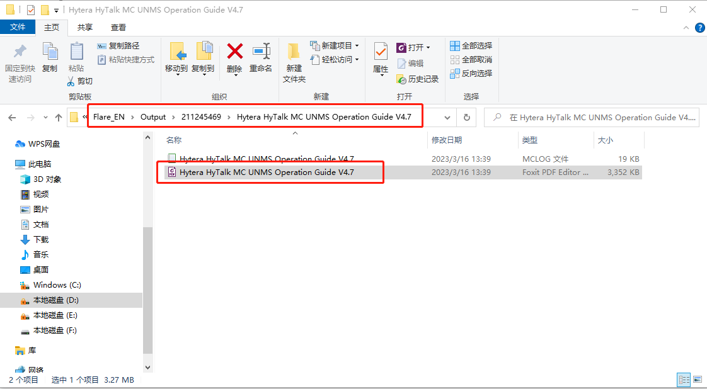{width="6.8381944444444445in"
height="3.7694444444444444in"}

- 如果交付联机帮助，先将整个联机帮助文件夹压缩打包，再发给需求人。

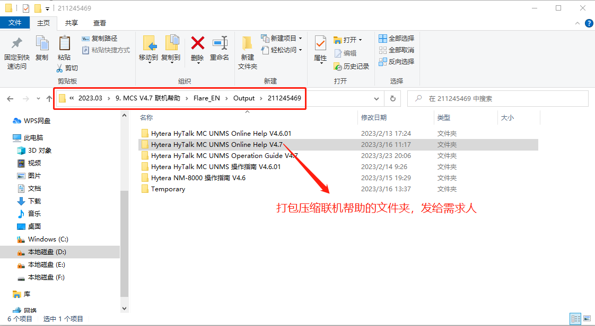{width="6.8381944444444445in"
height="3.754166666666667in"}

- 制作全新文档

直接用中文 Flare 文件修改，省去调整格式的时间。

a.  将中文 Flare 文件拖拽保存到本地。

<!-- -->

a.  打开中文Flare 文件，另存为英文 Flare 文件。

b.  修改内容后交付（步骤和要求同更新文档，参考 [交付文件](#交付文件)）。

# 文字相关操作

## 编辑Topic内容

##### 使用场景

根据中文修订记录，需要增删某个Topic的文字内容。

##### 步骤

1.  打开要修订的Topic。

2.  将光标定位到需要编辑的地方后，即可增删文字。

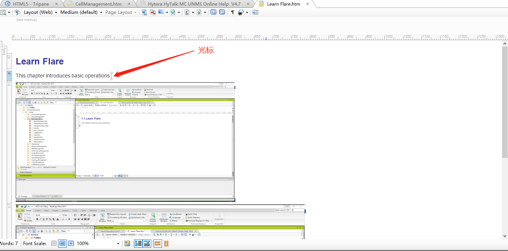{width="5.769444444444445in"
height="2.8381944444444445in"}

+-----------------------------------------------------------------------+
| {width="0.7923611111111111in"                 |
| height="0.23819444444444443in"}                                       |
+=======================================================================+
| > 如果Topic的内容无法编辑，参考[Topic的内容无法编辑](#内容无法编辑)。 |
+-----------------------------------------------------------------------+

## 添加新的Topic

##### 使用场景

若此次修订中需要增加新的小节，则需要添加Topic。

以给"BasicOperations"一章添加名为"Learn Flare"的topic为例。

##### 步骤

1.  单击"Project Organizer \> TOCs"。

2.  双击文件名，打开文件目录。

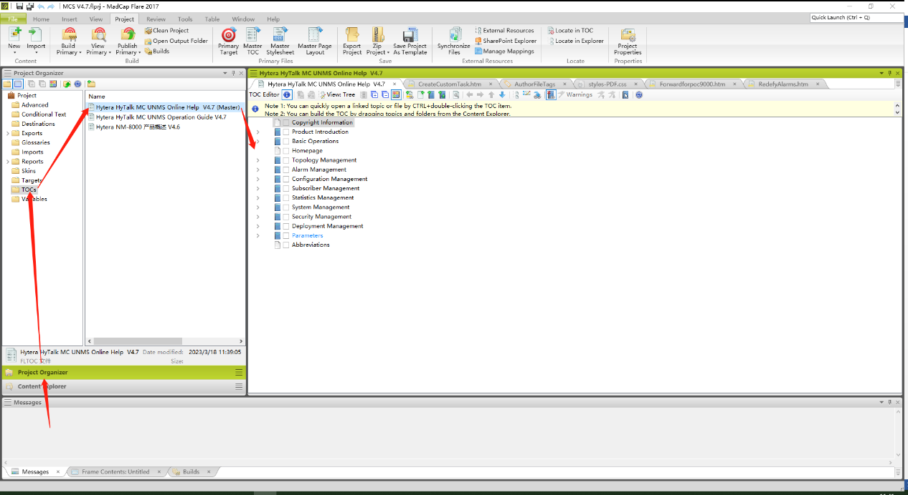{width="5.761805555555555in"
height="3.1458333333333335in"}

3.  右键单击一级标题，选择"Add New Topic..."。

4.  单击"Folder"后面的{width="0.2847222222222222in"
    height="0.2152777777777778in"}。

5.  在"Select
    Folder"对话框中，选择一级标题文件夹（"BasicOperations"），单击"OK"。

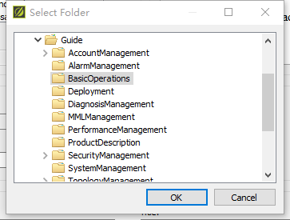{width="3.7847222222222223in"
height="2.8694444444444445in"}

6.  在"File Name:"对话框输入topic的标题（"Learn Flare"）。

7.  单击"Add"。

系统自动打开并停留在"Learn Flare"页面。

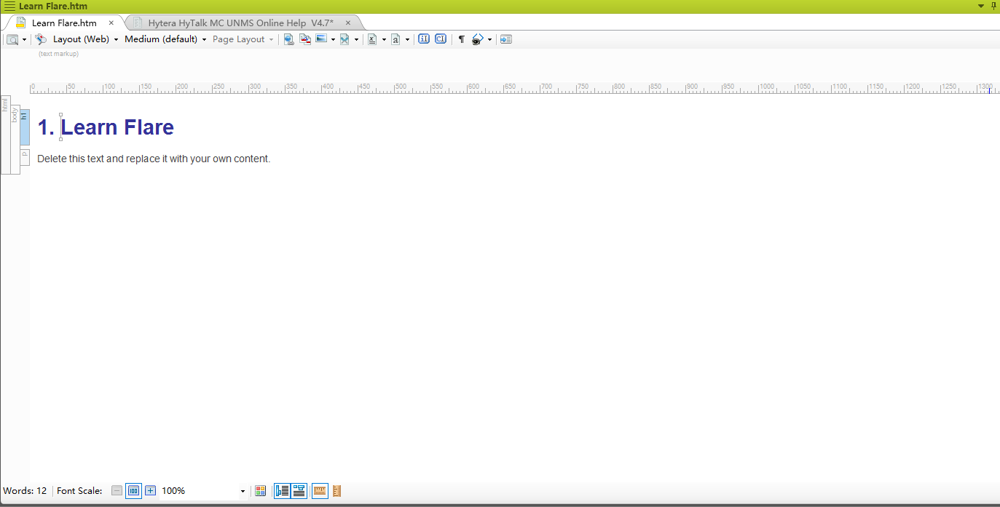{width="5.361805555555556in"
height="2.722916666666667in"}

8.  点击{width="0.26180555555555557in"
    height="0.22291666666666668in"}，保存更改。

## 打开跳转页面

##### 使用场景

联机帮助中，每个章节的首页都有本章二级标题的跳转链接汇总。可点击跳转链接到某个页面，再做修改。比如，以下页面的蓝色字体均为跳转到其他页面的超链接。要打开"Introduction"页面，按住【Ctrl】键，同时单击"Introduction".

##### 步骤

按住Ctrl键，单击页面标题（蓝色字体）

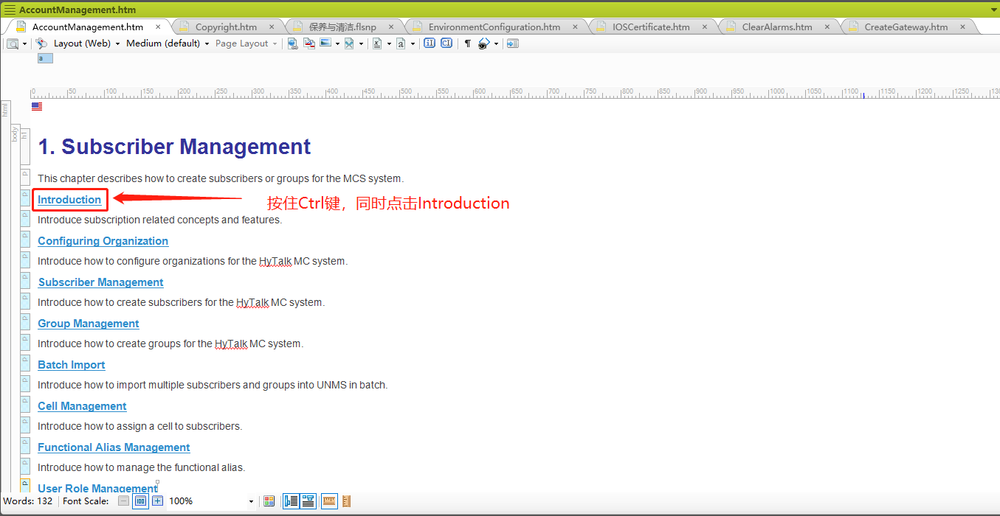{width="5.645833333333333in"
height="2.915277777777778in"}

## 添加超链接

##### 使用场景

各个一级标题下，有一个topic用于跳转到二级标题的页面。

比如，在"Basic Operations"页面添加"Learn Flare"页面的跳转链接。

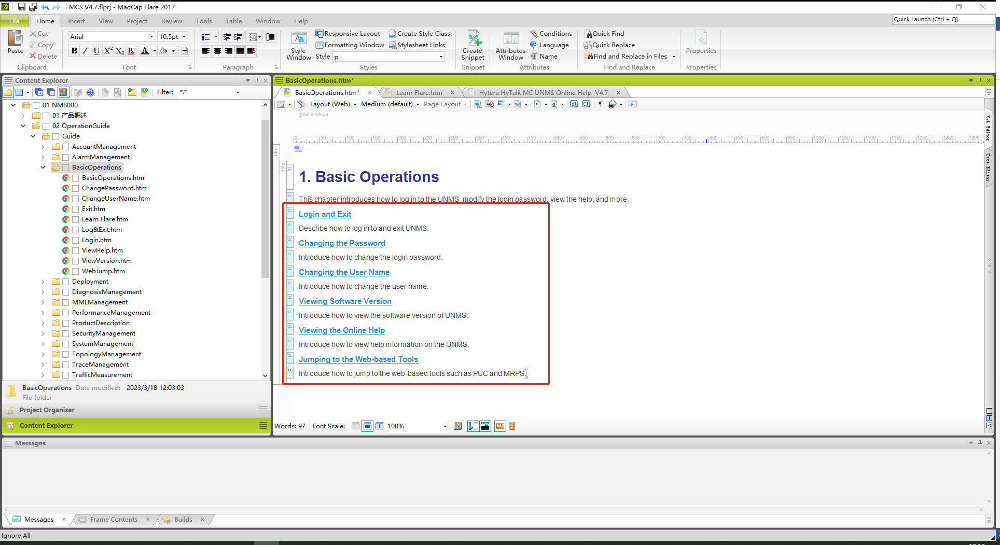{width="5.761805555555555in"
height="3.1458333333333335in"}

##### 步骤

1.  插入Learn Flare标题

- 复制粘贴

  i.  复制已有topic的标题和简介，粘贴到适当位置。

  ii. 将topic标题改为"Learn Flare"，修改简介。

  iii. 右键单击"Learn Flare"，选择"Edit Hyperlink"。

- 直接输入

  i.  在适当位置输入"Learn Flare"与简介。

  ii. 选中"Learn Flare"后，单击右键。

  iii. 选择"Insert \> Hyperlink"。

  <!-- -->

  1.  在"Insert Hyperlink"对话框中，选择"Learn Flare"。

  2.  单击"OK"。

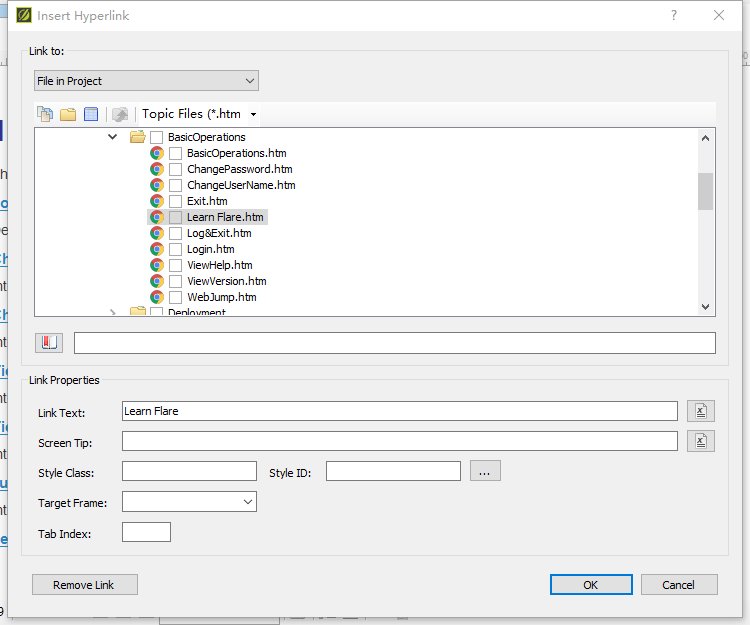{width="5.761805555555555in"
height="4.815277777777778in"}

## 设置发布格式

##### 使用场景

发布到联机帮助与操作指南的内容可能有出入。编辑Topic时，需要选择内容发布到哪种格式。

##### 步骤

1.  右键单击要修改的内容，选择"Conditions..."。

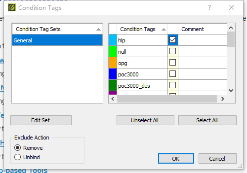{width="5.207638888888889in"
height="3.6618055555555555in"}

2.  选择输出格式。

- 勾选"hlp"，内容输出到联机帮助。

- 勾选"opg"，内容输出到操作指南。

  1.  单击"OK"。

## 打开拼写检查

1.  选择"Projects \> Project Properties"。

2.  点击"Language"。

3.  选中"English (United States)"，点击"OK"。

4.  选择"Tools"。

5.  勾选"Spell check while typing\"。

6.  重启项目，更改生效。

# 图片相关操作

## 添加图片到resources文件夹

##### 使用场景

网管的联机帮助和操作指南基本每个步骤都要配图。插入的图片多为页面截图。

以用企业微信截图为例。

##### 步骤

1.  用企业微信截图。

2.  右键单击截图，给图片命名，保存到非加密盘（一般为F盘）。

3.  在沙盒中打开非加密盘。

4.  将该图片复制粘贴到"resources"文件夹下对应的文件夹内。

## 添加新图片

##### 使用场景

系统有了新功能，需要在新的topic中加入配图。

##### 步骤

1.  将光标定位在插入图片的位置。

2.  单击{width="0.26944444444444443in"
    height="0.19236111111111112in"}。

3.  在"Insert Image"对话框中，选择"Resources \> Images".

4.  在相应文件夹中选择要插入的图片，点击"OK"。

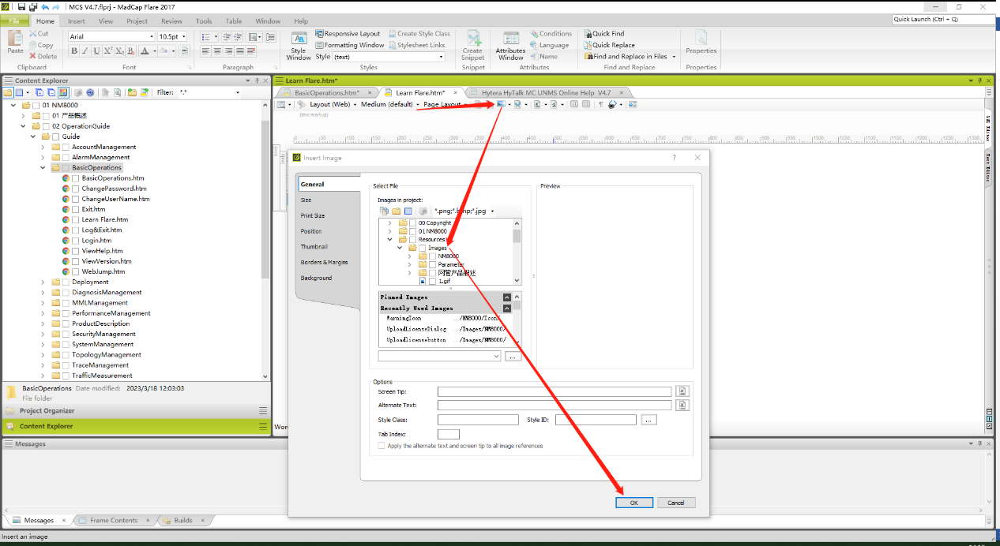{width="5.761805555555555in"
height="3.1458333333333335in"}

## 更换截图

##### 使用场景

系统页面更新后，需要更换操作步骤的配图。

以用企业微信截图为例

##### 步骤

1.  查看旧截图的文件夹位置。

    a.  选中旧截图。

    b.  点击"Text Editor"。

{alt="企业微信截图_16791212873167"
width="5.3381944444444445in" height="2.907638888888889in"}

2.  复制图片名（"Learn Flare"）。

3.  用企业微信截取系统新页面，命名时可粘贴图片名（"Learn
    Flare"），保存到非加密盘。

4.  将非机密盘的图片粘贴到"Resources"下旧截图所在的文件夹。

5.  在弹出的提示框中，单击"替换目标中的文件"。

页面的配图将自动替换为新截图。

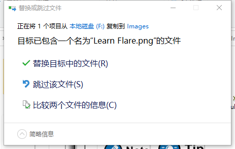{width="4.822916666666667in"
height="3.0694444444444446in"}

## 更改图片大小

##### 使用场景

插图图片后，需要根据输出格式更改图片大小。

##### 步骤

1.  选中图片。

2.  将鼠标悬停在图片右下角。

3.  选中图片光标，更改图片大小。

+-----------------------------------------------------------------------+
| {width="0.6305555555555555in"                  |
| height="0.24583333333333332in"}                                       |
+=======================================================================+
| > 对于以 .pdf 格式发布的资料，图片宽度一般需小于 600 px。             |
+-----------------------------------------------------------------------+

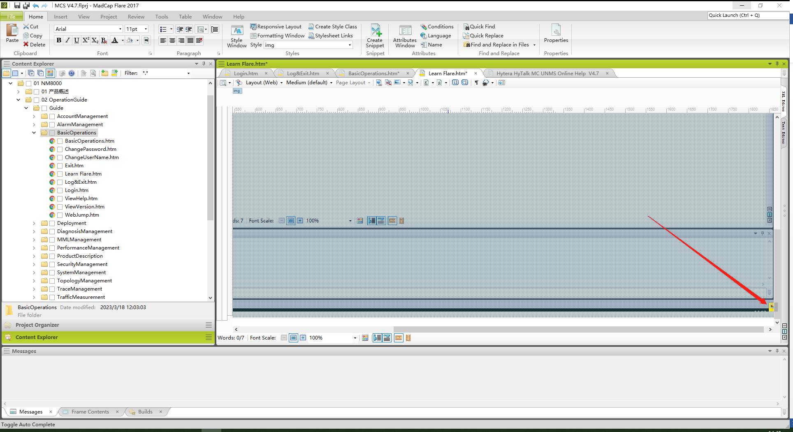{width="5.761805555555555in"
height="3.1458333333333335in"}

## 更改图片位置

##### 使用场景

插图图片后，需要根据输出格式更改图片位置。

##### 步骤

1.  选中图片。

2.  单击"Home"页签，选择图片位置。

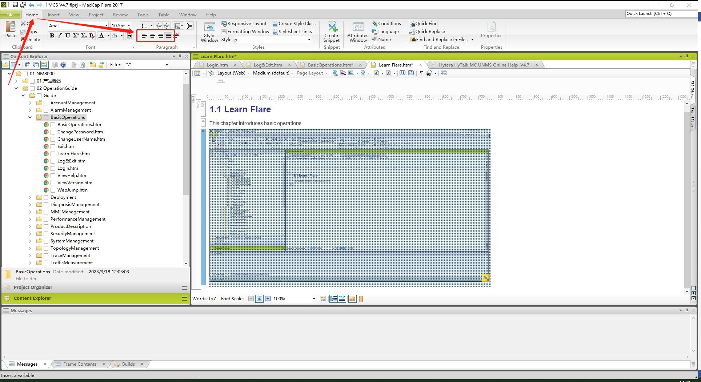{width="5.761805555555555in"
height="3.1458333333333335in"}

## 设置发布格式

参考[4.5](#设置发布格式) [设置发布格式](#设置发布格式)。

# 表格相关操作

## 插入行或列

##### 使用场景

修改后续操作、参数表格时，常需插入新的行或列。

以插入行为例。

##### 步骤

1.  右键单击选中表格中的某行。

2.  选择"Insert"。

3.  根据需求选择新行或新列的位置。

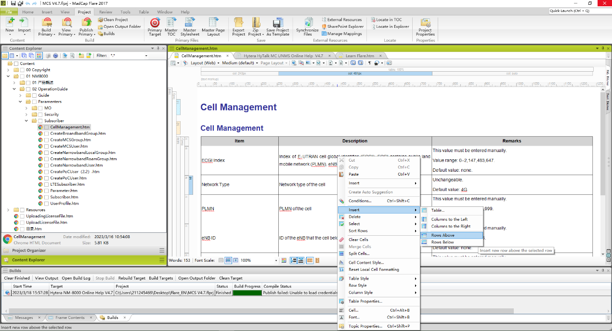{width="5.777083333333334in"
height="3.1305555555555555in"}

## 删除行或列

##### 使用场景

修改后续操作、参数表格时，常需删除行或列。

以删除行为例。

##### 步骤

1.  右键选中表格中的某行。

2.  选择"Delete"。

3.  根据需求选择删除行或列的位置。

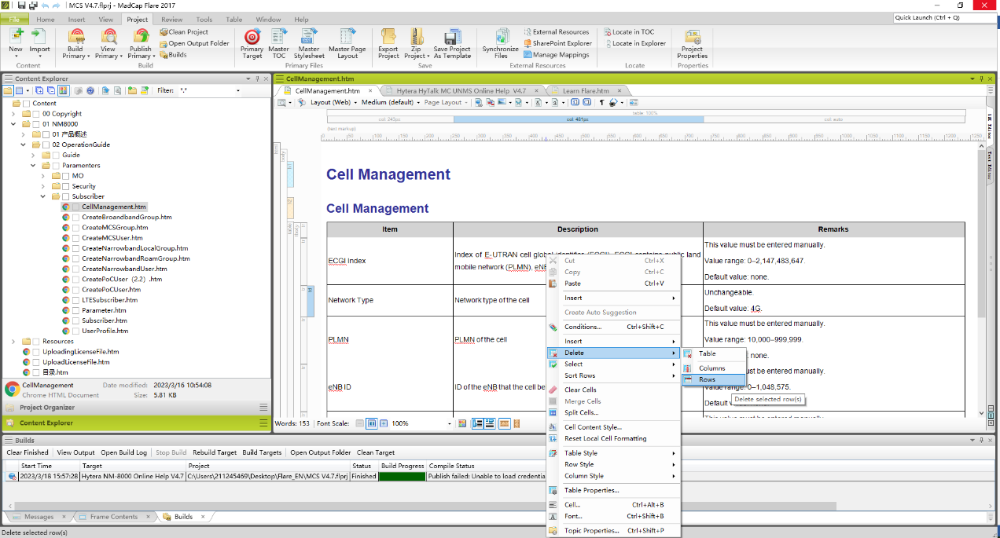{width="5.777083333333334in"
height="3.1152777777777776in"}

# 发布相关操作

## 设置Primary Target

##### 使用场景

发布内容前，需先将文件设置为Primary Target。

##### 步骤

1.  单击"Project Organizer \> Targets"。

2.  右键选择发布文件，选择"Make Primary"。

## 查看Primary Target设置

1.  单击"Project"。

2.  双击"Primary Target"。

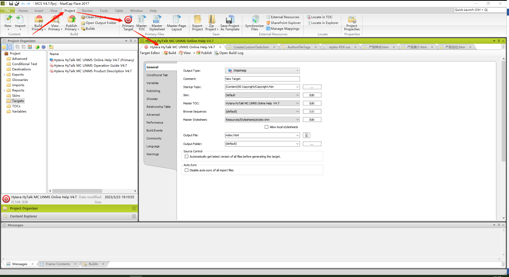{width="6.845833333333333in"
height="3.7381944444444444in"}

## 设置Master TOC

##### 使用场景

发布内容前，需先将文件的TOC设置为Master TOC。

##### 步骤

1.  单击"Project Organizer \> TOCs"。

2.  右键选择发布文件，选择"Make Master TOC"。

## 查看Master TOC设置

1.  单击"Project"。

2.  双击"Master TOC"。

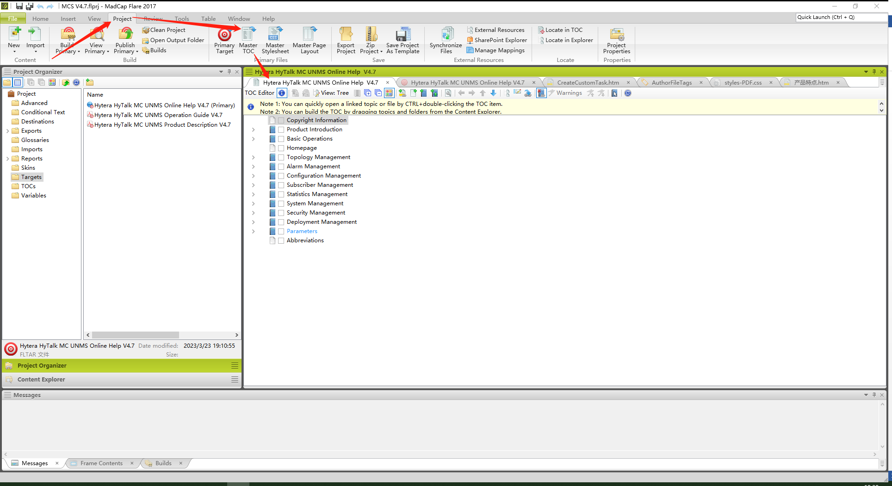{width="6.845833333333333in"
height="3.7381944444444444in"}

## 改变章节顺序

##### 使用场景

文档更新后，改变了原有章节的顺序。

##### 步骤

1.  单击"Project Organizer \> TOCs"。

2.  双击打开要修改的TOC文件。

3.  选中要移动的小节，拖动到适当的位置。

## 预览发布内容

##### 使用场景

文件修订完成后，预览文件输出效果。

##### 步骤

1.  单击"Project \> View Primary"。

2.  (可选) 如果想要预览其他文件的输出效果，点击"View
    Primary"右下角的三角，选择要预览的文件。

## 删除公司logo

##### 使用场景

有些项目需要删除文档里的公司logo。

##### 步骤

1.  单击"Project Organizer \> Skins"。

2.  双击打开"HTML5 - Tripane"。

3.  选择"Styles \> Logo \> Background"。

4.  在"Image"的下拉菜单中，选择"none"。

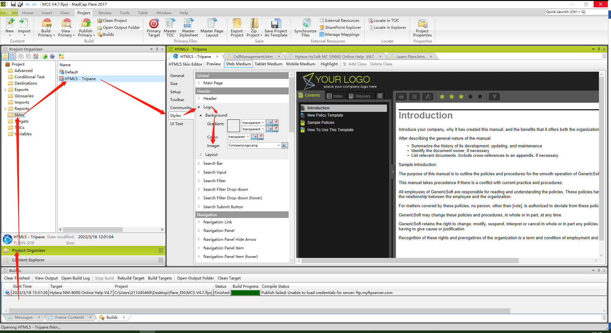{width="6.845833333333333in"
height="3.7381944444444444in"}

5.  单击{width="0.26180555555555557in"
    height="0.22291666666666668in"}，保存更改。

## 保存

- 单击{width="0.26944444444444443in"
  height="0.22291666666666668in"}保存当前页面的修改内容

- 单击{width="0.26180555555555557in"
  height="0.22291666666666668in"}保存所有页面的修改内容

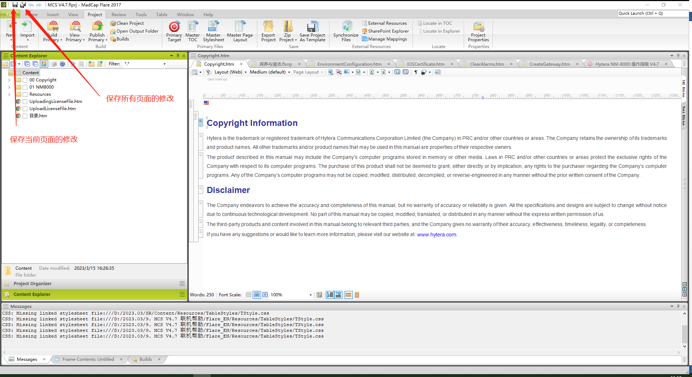{width="5.761805555555555in"
height="3.1458333333333335in"}

## 发布文件

##### 使用场景

文件修订完成后，按需求输出交付文件。

##### 步骤

1.  点击"Project Organizer"。

2.  把发布文件设置为Primary Target。参考[7.1](#设置primary-target)
    [设置Primary Target](#设置primary-target)。

3.  把发布内容的TOC设置为Master TOC。参考[7.3](#设置master-toc)
    [设置Master TOC](#设置master-toc)。

4.  单击"Project \> Publish Primary"。

5.  在"MadCap Flare 2017"对话框中，选择"是"。

6.  （可选）双击发布状态栏的任一位置可打开文件。

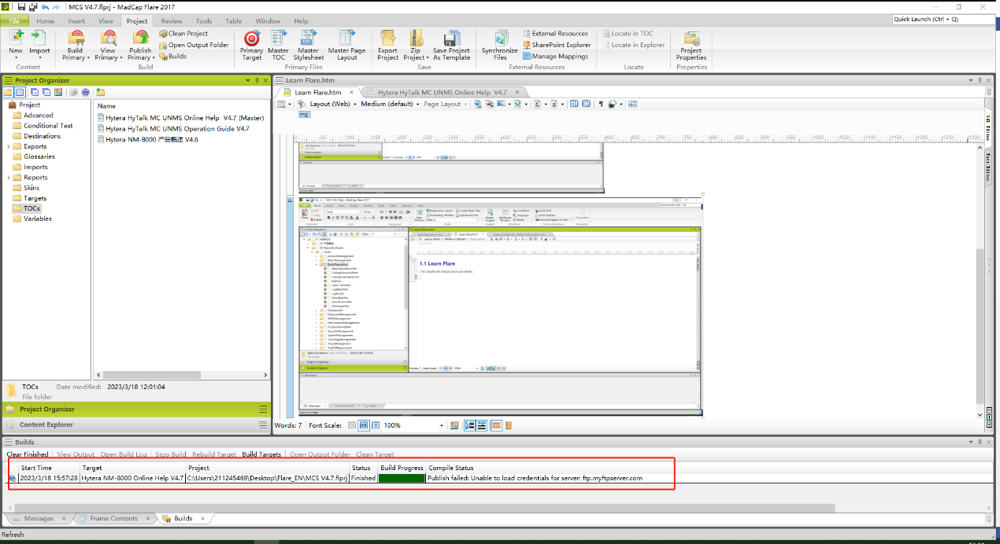{alt="企业微信截图_16791271212946"
width="5.761805555555555in" height="3.1458333333333335in"}

  -----------------------------------------------------------------
  {width="0.6305555555555555in"
  height="0.23819444444444443in"}
  -----------------------------------------------------------------
  "Status"为"Finished"则输出成功。"Compile Status"里的"Publish
  failed:..."不用理会。

  -----------------------------------------------------------------

# 常见问题

+------------------------------+--------------------------------------------------------------+--------------------------------------------------------------------------------------------------------------------------------+
| 现象                         | 原因                                                         | 解决方法                                                                                                                       |
+==============================+==============================================================+================================================================================================================================+
| []{#内容无法编辑             | 要编辑的内容实际属于另一个Topic（一般在"Snippet"文件夹下）。 | 1.  点击无法编辑内容左边的"MadCap:snippetBlock"，选中该段内容.                                                                 |
| .anchor}Topic的内容无法编辑  |                                                              |                                                                                                                                |
|                              |                                                              | 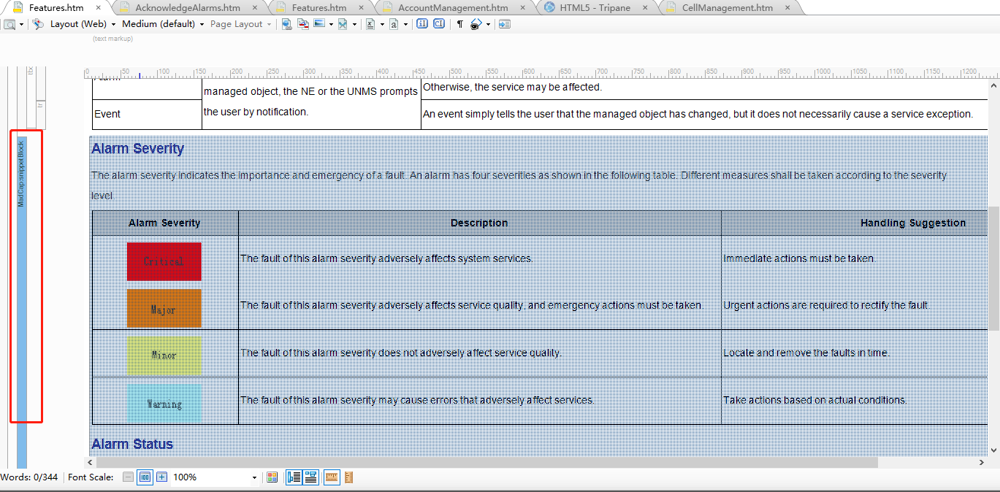{width="4.061805555555556in" height="2.0in"}                                |
|                              |                                                              |                                                                                                                                |
|                              |                                                              | 2.  切换到"XML Editor"页面。参考[2.5](#text-editor)                                                                            |
|                              |                                                              |                                                                                                                                |
|                              |                                                              | 3.                                                                                                                             |
|                              |                                                              |                                                                                                                                |
|                              |                                                              | [Text EditorText                                                                                                               |
|                              |                                                              | Editor显示该页面的具体内容，如文字、图片、表格。{width="6.845833333333333in" |
|                              |                                                              | height="3.7381944444444444in"}](#text-editor)                                                                                  |
|                              |                                                              |                                                                                                                                |
|                              |                                                              | 4.  [XML Editor](#text-editor)。                                                                                               |
|                              |                                                              |                                                                                                                                |
|                              |                                                              | 5.  查看该段内容实际所属Topic的路径。                                                                                          |
|                              |                                                              |                                                                                                                                |
|                              |                                                              | 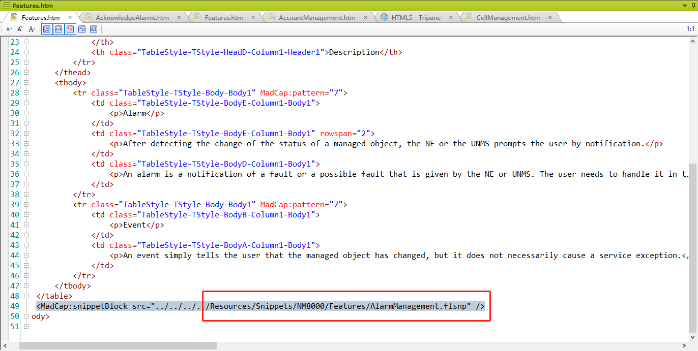{width="4.061805555555556in" height="2.0381944444444446in"}                 |
|                              |                                                              |                                                                                                                                |
|                              |                                                              | 6.  按路径找到并打开正确的Topic。                                                                                              |
|                              |                                                              |                                                                                                                                |
|                              |                                                              | 7.  修改内容。                                                                                                                 |
+------------------------------+--------------------------------------------------------------+--------------------------------------------------------------------------------------------------------------------------------+
| 图片变形                     | 图片被压缩                                                   | 1.  选中图片。                                                                                                                 |
|                              |                                                              |                                                                                                                                |
|                              |                                                              | <!-- -->                                                                                                                       |
|                              |                                                              |                                                                                                                                |
|                              |                                                              | 8.  右键选择"Reset Size"。                                                                                                     |
|                              |                                                              |                                                                                                                                |
|                              |                                                              | 9.  重新调整图片大小。参考[5.4](#更改图片大小) [更改图片大小](#更改图片大小)。                                                 |
+------------------------------+--------------------------------------------------------------+--------------------------------------------------------------------------------------------------------------------------------+
| 操作指南中出现联机帮助的内容 | 内容的Condition设置不正确                                    | 重新设置内容的Condition。参考[4.5](#设置发布格式) [设置发布格式](#设置发布格式)。                                              |
+------------------------------+--------------------------------------------------------------+--------------------------------------------------------------------------------------------------------------------------------+
| 导出失败                     | 导出文件夹的路径太复杂                                       | 更改文件的发布位置，比如发布到桌面。                                                                                           |
|                              +--------------------------------------------------------------+--------------------------------------------------------------------------------------------------------------------------------+
|                              | 文件代码有误                                                 | 1.  根据错误提示定位并打开错误页面。                                                                                           |
|                              |                                                              |                                                                                                                                |
|                              |                                                              | <!-- -->                                                                                                                       |
|                              |                                                              |                                                                                                                                |
|                              |                                                              | 10. 对照中文Flare文件修改代码，或把中文页面复制过来，把中文修改为英文。                                                        |
+------------------------------+--------------------------------------------------------------+--------------------------------------------------------------------------------------------------------------------------------+

# 常用格式的 XML 代码

  -----------------------------------------------------------------------
  格式         代码
  ------------ ----------------------------------------------------------
  一级ul       \<ul class=\"ul1\"\>\l \</span\>content content content\</ul\>

  二级ul       \<ul class=\"ul2\" style=\"margin-left: 1.0ch;\"\>\† \</span\>content
               content content\</ul\>

               
  -----------------------------------------------------------------------

# 相关资料

  -----------------------------------------------------------------------------------------
  相关资料                 SVN地址
  ------------------------ ----------------------------------------------------------------
  Flare入门.pptx           http://192.168.240.194/ptyf/PK_RES_DB/1.
                           资料开发/3.平台工作/5.培训及分享/Flare-面向翻译/Flare入门.pptx

  Flare使用总结.docx       http://192.168.240.194/ptyf/PK_RES_DB/1.
                           资料开发/3.平台工作/5.培训及分享/Flare/Flare使用总结.docx

  Flare基本操作介绍.pptx   http://192.168.240.194/ptyf/PK_RES_DB/1.
                           资料开发/3.平台工作/5.培训及分享/Flare/Flare基本操作介绍.pptx
  -----------------------------------------------------------------------------------------
